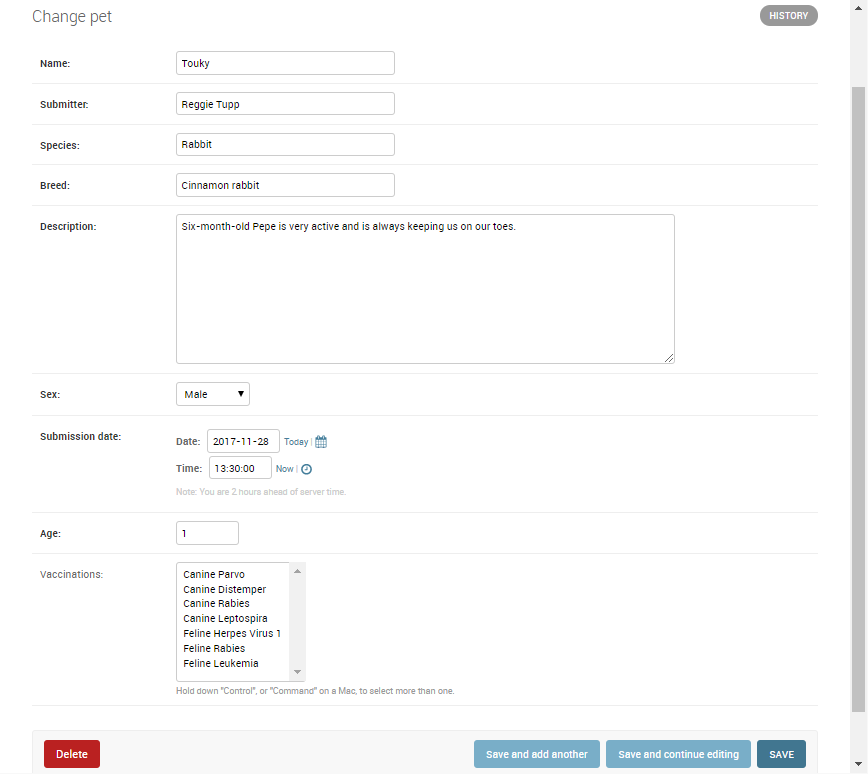
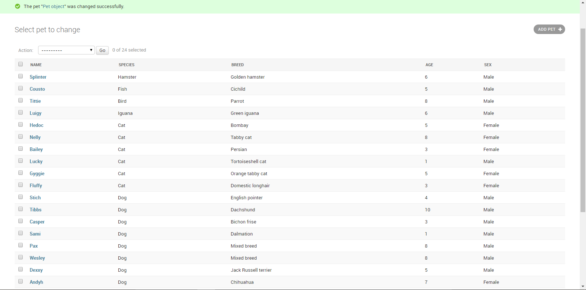

# About Pets Adopt Clinic 
Pet Adopt Clinic is a fictitious brand created by me, solely for the purpose of showcasing my python/Django programing skill. All products and people associated with Pet Adopt Clinic are also fictitious. Any resemblance to real brands, products, or people is purely coincidental. Please see your veterinarian for all matters related to your pet's health.

---

## Objective 
creating a brand-new Django project, defining a data model and fields, querying the database, and using Django's built-in URL handlers, views, and templates to structure the rest of the backend. Plus, incorporating CSS and JavaScript to enhance the style and usability of Django templates.

---
## Skills exercised in this project 
- Creating a new Django project
- Defining Django models and fields
- Performing Django migrations
- Querying data with the Django ORM
- Building URL handlers and views
- Building Django templates
- Integrating CSS and JavaScript in Django templates

---

## Pets registration admin dashboard 

---

---

### Thank you 
